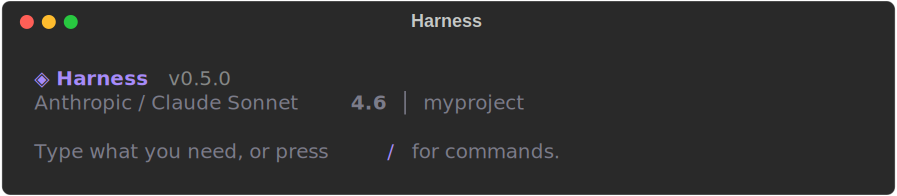
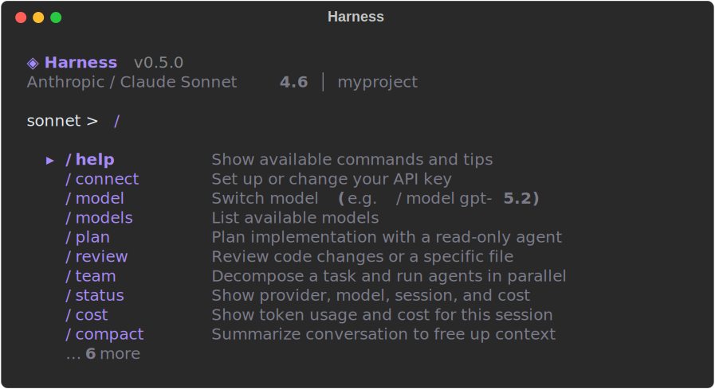
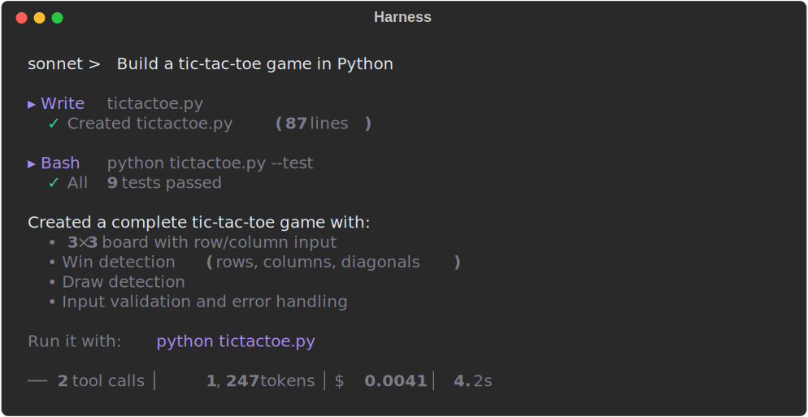
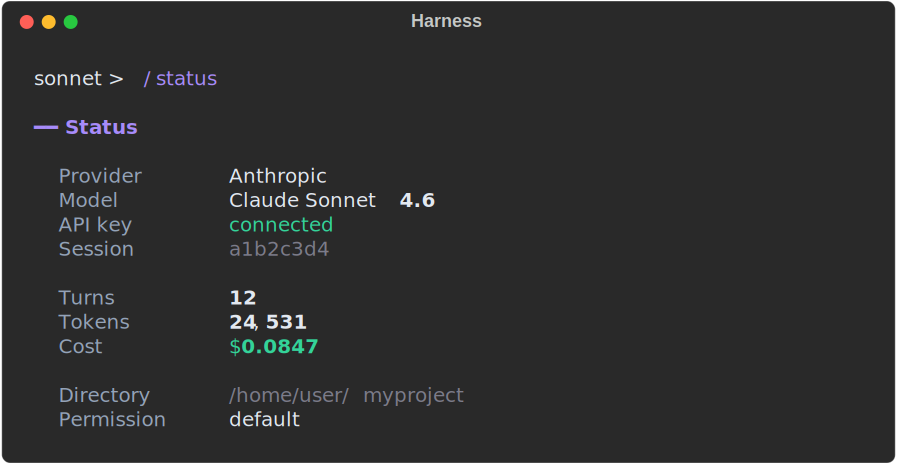
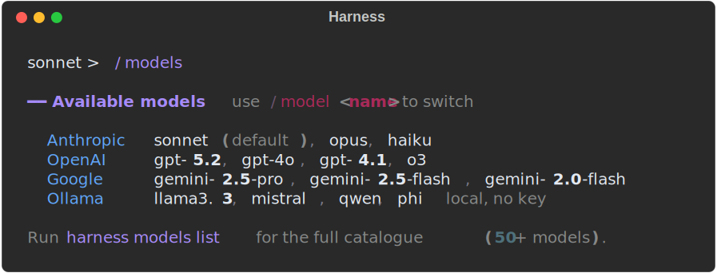

<div align="center">

# Harness

### State-of-the-art open-source coding agent

CLI + SDK that works with **any** LLM — Claude, GPT, Gemini, Ollama, or any OpenAI-compatible endpoint.

The only open-source agent to score **100% on Harness-Bench** and outperform Claude Code, OpenCode, and pi-mono.

[](LICENSE)
[](https://python.org)
[](https://pypi.org/project/harness-agent/)
[](https://github.com/AgentBoardTT/openharness)

[Quick Start](#-quick-start) · [Screenshots](#-screenshots) · [Commands](#-interactive-repl-commands) · [Providers](#-providers) · [Features](#-features) · [SDK](#-sdk) · [Benchmarks](#-benchmark-results) · [Contributing](#-contributing)

</div>

---

## ⚡ Quick Start

### Install

```bash
curl -fsSL https://raw.githubusercontent.com/AgentBoardTT/openharness/main/install.sh | bash
```

Or with pip:

```bash
pip install harness-agent
```

### Connect

```bash
harness connect
```

Pick a provider, paste your API key, done. Your key is saved to `~/.harness/config.toml`.

> **Where do I get an API key?**
> - Anthropic (Claude): https://console.anthropic.com/settings/keys
> - OpenAI (GPT): https://platform.openai.com/api-keys
> - Google (Gemini): https://aistudio.google.com/apikey

### Use

```bash
# Interactive REPL
harness

# One-shot command
harness "Fix the authentication bug in auth.py"

# Bypass mode — full auto-approve, no prompts (great for CI/scripts)
harness --permission bypass "Run all tests and fix failures"
```

```bash
# Use a specific model
harness -p openai -m gpt-5.2 "Refactor this function"

# Use a local model (no API key, fully private)
harness -p ollama -m llama3.3 "Write unit tests for utils.py"

# Resume a previous session
harness --session abc123 "Continue where we left off"
```

That's it. You're running a state-of-the-art coding agent.

<p align="right"><a href="#harness">back to top</a></p>

---

## 📸 Screenshots

### REPL Banner



### Interactive Command Palette

Type `/` to open a filterable command palette. Arrow keys navigate, Enter selects, Escape dismisses.



### Agent Execution



### Status & Models




<p align="right"><a href="#harness">back to top</a></p>

---

## 🎛 Interactive REPL Commands

Type `/` in the REPL to open the command palette, or use any command directly.

| Command | Description |
|---------|-------------|
| `/help` | Show available commands and tips |
| `/connect` | Set up or change your API key |
| `/model` | Switch model (e.g. `/model gpt-5.2`) |
| `/models` | List available models |
| `/plan` | Plan implementation with a read-only agent |
| `/review` | Review code changes or a specific file |
| `/team` | Decompose a task and run agents in parallel |
| `/status` | Show provider, model, session, and cost |
| `/cost` | Show token usage and cost for this session |
| `/compact` | Summarize conversation to free up context |
| `/session` | Show or switch session ID |
| `/diff` | Show git diff of changes in working directory |
| `/init` | Create a HARNESS.md project config file |
| `/doctor` | Check your setup (provider, API key, tools) |
| `/permission` | View or change permission mode |
| `/clear` | Clear the screen |

<p align="right"><a href="#harness">back to top</a></p>

---

## 🔌 Providers

Harness works with every major AI provider — switch with a single flag.

| Provider | Models | How to connect |
|----------|--------|--------|
| **Anthropic** | Claude Opus 4.6, Sonnet 4.6, Haiku 4.5 | `harness connect` and choose Anthropic |
| **OpenAI** | GPT-5.2, GPT-4.1, o3, o4-mini, GPT-4o | `harness connect` and choose OpenAI |
| **Google** | Gemini 2.5 Pro, 2.5 Flash, 2.0 Flash | `harness connect` and choose Google |
| **Ollama** | Llama, Mistral, Qwen, Phi, etc. | No key needed — runs locally |
| **OpenAI-compatible** | DeepSeek, Groq, OpenRouter | `--base-url` flag |

```bash
harness models list          # Browse 50+ supported models
harness models info sonnet   # Get details for a specific model
```

<p align="right"><a href="#harness">back to top</a></p>

---

## 🛠 Features

### Built-in Tools

| Tool | What it does |
|------|-------------|
| **Read** | Read file contents |
| **Write** | Create or overwrite files |
| **Edit** | Find-and-replace inside files |
| **Bash** | Run shell commands |
| **Glob** | Find files by name pattern |
| **Grep** | Search inside files with regex |
| **Task** | Spawn sub-agents for parallel work |
| **WebFetch** | Pull content from web pages |
| **AskUser** | Ask you a question mid-task |
| **Checkpoint** | Save/restore file snapshots |

### Sub-Agents

The agent can spin up specialized workers in parallel:

| Agent | Access | Use Case |
|-------|--------|----------|
| **general** | Full tools | Complex multi-step tasks |
| **explore** | Read-only | Fast codebase exploration |
| **plan** | Read-only | Architecture planning |
| **review** | Read-only | Structured code review |

### Permission Modes

You control what the agent can do:

| Mode | Behavior |
|------|----------|
| `default` | Reads are automatic, writes ask for approval |
| `accept_edits` | File edits are automatic, shell commands ask |
| `plan` | Read-only — nothing gets changed |
| `bypass` | Full auto-approve (for scripts/CI) |

### Interactive Command Palette

Type `/` in the REPL to open a filterable dropdown. Arrow keys navigate, typing filters, Enter selects, Escape dismisses. All 16 slash commands are accessible instantly.

### Async Steering (Live Message Injection)

While the agent is executing, type a message and press Enter to inject it between turns. The steering channel queues your message and the agent processes it at the next turn boundary — no need to wait for it to finish.

### Context Compaction

When the conversation approaches the model's context limit (85% threshold), Harness automatically summarizes earlier messages while preserving key information. The compacted context targets 50% of the window, giving you room to keep working without starting a new session.

### MCP (Model Context Protocol)

Connect external tool servers — Jira, Slack, databases, anything with an MCP adapter:

```python
async for msg in harness.run(
    "Search our Jira board",
    mcp_servers={
        "jira": {
            "command": "npx",
            "args": ["-y", "@anthropic/mcp-server-jira"],
            "env": {"JIRA_TOKEN": "..."},
        }
    },
):
    ...
```

### Skills

Teach the agent custom workflows by dropping a `.md` file in `.harness/skills/`:

```markdown
---
name: deploy
description: Deploy to production
user_invocable: true
---

1. Run the test suite: `pytest tests/ -v`
2. Build the Docker image: `docker build -t myapp .`
3. Push to registry and deploy
```

### Hooks

Run your own commands before/after every tool call:

```python
hooks = [
    harness.Hook(
        event=harness.HookEvent.PRE_TOOL_USE,
        command="echo 'About to run {tool_name}'",
        matcher="Bash",
    ),
]

async for msg in harness.run("Fix the tests", hooks=hooks):
    ...
```

### Memory

- **Project instructions** — Drop a `HARNESS.md` in your project root
- **Auto-memory** — Learnings persist across sessions in `~/.harness/memory/`

<p align="right"><a href="#harness">back to top</a></p>

---

## 🐍 SDK

Use Harness as a Python library to build your own tools on top of it.

### Basic Usage

```python
import harness

async for msg in harness.run("Fix the bug in auth.py"):
    match msg:
        case harness.TextMessage(text=t, is_partial=False):
            print(t)
        case harness.ToolUse(name=name):
            print(f"Using tool: {name}")
        case harness.Result(text=t, total_tokens=tok):
            print(f"Done ({tok} tokens): {t}")
```

### With Configuration

```python
async for msg in harness.run(
    "Refactor the database module",
    provider="openai",
    model="gpt-4.1",
    permission_mode="accept_edits",
    max_turns=50,
):
    ...
```

### Sub-Agent API

```python
from harness.agents.manager import AgentManager

mgr = AgentManager(provider=provider, tools=tools, cwd=".")
result = await mgr.spawn("explore", "Find all API endpoints")

# Parallel execution
results = await mgr.spawn_parallel([
    ("explore", "Find all API endpoints"),
    ("explore", "Find all database models"),
    ("review", "Review the auth module"),
])
```

### Steering Channel (Async Message Injection)

Inject messages into the agent loop while it's running:

```python
from harness.core.steering import SteeringChannel

steering = SteeringChannel()

# Start the agent with steering enabled
async for msg in harness.run(
    "Refactor the API layer",
    steering=steering,
):
    print(msg)

# From another coroutine, inject a message between turns:
await steering.send("Actually, skip the auth endpoints")
```

<p align="right"><a href="#harness">back to top</a></p>

---

## 📊 Benchmark Results

Harness was benchmarked against the leading coding agents on 8 real-world tasks covering multi-file editing, bug fixing, error recovery, refactoring, context understanding, and code analysis.

### Overall Scores

| Agent | Claude Opus 4.6 | GPT-5.2 |
|-------|:---:|:---:|
| **Harness** | **7/8 (88%)** | **8/8 (100%)** |
| Claude Code | 7/8 (88%) | — |
| OpenCode | 7/8 (88%) | 7/8 (88%) |
| pi-mono | 7/8 (88%) | 8/8 (100%) |

Harness is the **only open-source agent** that achieves a perfect score — and it does so across providers, not locked to one.

### Per-Task Breakdown (GPT-5.2)

| Task | Harness | OpenCode | pi-mono |
|------|:---:|:---:|:---:|
| Multi-file editing | PASS (17.5s) | PASS (19.4s) | PASS (26.8s) |
| Error recovery | PASS (5.2s) | PASS (11.7s) | PASS (10.1s) |
| Tool efficiency | PASS (1.8s) | PASS (5.6s) | PASS (9.2s) |
| Context understanding | PASS (9.7s) | FAIL | PASS (41.3s) |
| Project creation | PASS (3.0s) | PASS (7.6s) | PASS (3.8s) |
| Bug fixing | PASS (5.5s) | PASS (12.9s) | PASS (10.0s) |
| Code analysis | PASS (1.9s) | PASS (5.2s) | PASS (2.3s) |
| Refactoring | PASS (6.4s) | PASS (11.7s) | PASS (12.7s) |

### Speed

| Agent | Model | Avg per Task | Total (8 tasks) |
|-------|-------|:---:|:---:|
| **Harness** | **GPT-5.2** | **6.4s** | **51.0s** |
| Harness | Opus 4.6 | 12.5s | 99.7s |
| Claude Code | Opus 4.6 | 16.4s | 131.5s |
| OpenCode | GPT-5.2 | 10.7s | 85.8s |
| pi-mono | GPT-5.2 | 14.5s | 116.2s |

Harness is **2x faster** than the next-fastest agent on GPT-5.2, and **30% faster** than Claude Code on Opus.

<p align="right"><a href="#harness">back to top</a></p>

---

## ⚙️ Configuration

### Config File

Created automatically by `harness connect`. Lives at `~/.harness/config.toml`:

```toml
[providers.anthropic]
api_key = "sk-ant-..."

[providers.openai]
api_key = "sk-..."
```

### Environment Variables

If you prefer env vars, those work too:

```bash
export ANTHROPIC_API_KEY="sk-ant-..."
export OPENAI_API_KEY="sk-..."
export GOOGLE_API_KEY="AIza..."
```

<p align="right"><a href="#harness">back to top</a></p>

---

## 🏗 Architecture

```
src/harness/
  core/
    engine.py          Top-level run() entry point
    loop.py            Agent loop (provider -> tools -> repeat)
    session.py         JSONL session persistence
    context.py         Context window management + compaction
    config.py          Config loading (env, TOML, HARNESS.md)
    steering.py        Async steering channel for live message injection
  providers/
    anthropic.py       Claude adapter
    openai.py          GPT / OpenAI-compatible adapter
    google.py          Gemini adapter
    ollama.py          Ollama local model adapter
    registry.py        Model catalogue (50+ models)
  tools/               Read, Write, Edit, Bash, Glob, Grep, Task, Web, etc.
  agents/              Sub-agent registry + lifecycle manager
  hooks/               Pre/post tool-use hook system
  mcp/                 MCP client + progressive tool discovery
  skills/              Skill loader (SKILL.md parser)
  memory/              Auto-memory + project instructions
  permissions/         Permission rules engine
  ui/                  Rich terminal output + streaming + diffs
  eval/                SWE-bench, Harness-Bench, metrics, reports
  cli/                 Click CLI entry point + subcommands
```

<p align="right"><a href="#harness">back to top</a></p>

---

## 🧪 Evaluation

### Run Benchmarks

```bash
# Quick validation — 8 tasks, ~$1
harness eval harness-bench --provider anthropic --model sonnet

# SWE-bench Lite — 300 real GitHub issues
harness eval swe-bench --split lite --max-tasks 10

# List benchmarks
harness eval list
```

### Available Benchmarks

| Benchmark | Tasks | Description |
|-----------|-------|-------------|
| **Harness-Bench** | 8 | Multi-file editing, error recovery, refactoring, analysis |
| **SWE-bench Lite** | 300 | Curated subset of real GitHub issues |
| **SWE-bench Verified** | 500 | Human-verified solvable issues |
| **SWE-bench Full** | 2,294 | Complete benchmark |

<p align="right"><a href="#harness">back to top</a></p>

---

## 🔧 Development

```bash
git clone https://github.com/AgentBoardTT/openharness.git
cd openharness
uv pip install -e ".[dev]"
uv run pytest tests/ -v
uv run ruff check src/ tests/
```

---

## 🤝 Contributing

We'd love your help. Here's how:

- **Bug reports** — [Open an issue](https://github.com/AgentBoardTT/openharness/issues)
- **Feature requests** — [Open an issue](https://github.com/AgentBoardTT/openharness/issues)
- **Pull requests** — Fork, branch, submit

Areas where we especially need help:
- New provider adapters
- Additional tools
- Benchmark tasks and evaluation
- Documentation and examples

---

## 📄 License

[MIT](LICENSE)

<div align="center">

**The best agent scaffold is an open one.**

</div>
